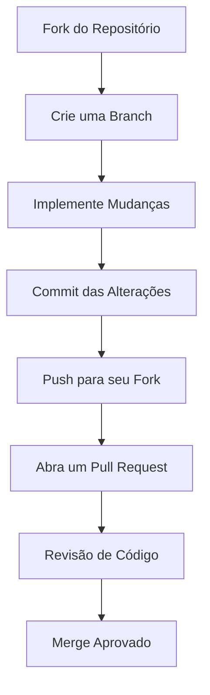

# ✨ ContatoFácil

<div align="center">
  
  
  <p><i>Simplifique sua gestão de contatos com uma plataforma intuitiva e moderna</i></p>
  
  [](https://github.com/seu-usuario/contatofacil)
  [](LICENSE)
</div>

## 🚀 Sobre o Projeto

**ContatoFácil** é mais que um simples gerenciador de contatos - é uma solução completa desenvolvida para revolucionar como você organiza suas conexões profissionais e pessoais. 

Com uma interface limpa e fluxos de trabalho otimizados, o ContatoFácil transforma a tarefa rotineira de gerenciar contatos em uma experiência agradável.

## ✅ Recursos Principais

<table align="center">
  <tr>
    <td>
      <h3>📝 Gestão de Contatos</h3>
      <ul>
        <li>Adicione contatos com detalhes completos</li>
        <li>Edição rápida e intuitiva</li>
        <li>Remoção com confirmação de segurança</li>
      </ul>
    </td>
    <td>
      <h3>👤 Sistema de Usuários</h3>
      <ul>
        <li>Cadastro simplificado</li>
        <li>Autenticação segura</li>
        <li>Gerenciamento de perfil</li>
      </ul>
    </td>
  </tr>
  <tr>
    <td>
      <h3>🔒 Segurança</h3>
      <ul>
        <li>Login protegido</li>
        <li>Criptografia de dados sensíveis</li>
        <li>Controle de acesso</li>
      </ul>
    </td>
    <td>
      <h3>🎨 Interface Intuitiva</h3>
      <ul>
        <li>Design responsivo</li>
        <li>Navegação simplificada</li>
        <li>Experiência de usuário otimizada</li>
      </ul>
    </td>
  </tr>
</table>

## 🛠️ Tecnologias

<div align="center">
  
  
  
  
  
  
  
  
  
</div>

## 🚦 Começando

### Pré-requisitos

- .NET 6.0 SDK ou superior
- Visual Studio 2022 ou VS Code
- SQL Server (local ou remoto)
- Git

### ⚙️ Instalação

<details>
<summary><b>Clique para expandir as instruções detalhadas</b></summary>

1. **Clone o repositório**
   ```bash
   git clone https://github.com/seu-usuario/contatofacil.git
   cd contatofacil
   ```

2. **Restaure as dependências**
   ```bash
   dotnet restore
   ```

3. **Configure a conexão com o banco de dados**
   
   Edite o arquivo `appsettings.json`:
   ```json
   "ConnectionStrings": {
     "DefaultConnection": "Server=seu-servidor;Database=ContatoFacil;Trusted_Connection=True;MultipleActiveResultSets=true"
   }
   ```

4. **Execute as migrações**
   ```bash
   dotnet ef database update
   ```

5. **Inicie a aplicação**
   ```bash
   dotnet run
   ```

6. **Acesse a aplicação**
   
   Abra seu navegador e acesse:
   ```
   http://localhost:5000
   ```

</details>

## 📋 Fluxo de Desenvolvimento



## 🤝 Contribuindo

Adoraríamos sua contribuição para tornar o ContatoFácil ainda melhor! Siga estes passos:

1. 🍴 **Fork este repositório**
2. 🌿 **Crie uma branch para sua feature**
   ```bash
   git checkout -b feature/nome-incrivel
   ```
3. 💻 **Faça suas alterações**
4. 📝 **Commit suas mudanças**
   ```bash
   git commit -m '✨ Adiciona funcionalidade incrível'
   ```
5. 📤 **Push para a branch**
   ```bash
   git push origin feature/nome-incrivel
   ```
6. 🔄 **Abra um Pull Request**

## 📸 Screenshots

<div align="center">
  <p><i>Imagens da interface em breve!</i></p>
</div>

## 📬 Contato

<div align="center">
  
  [](mailto:g.moreno.souza05@gmail.com)
  [](https://www.linkedin.com/in/gustavo-moreno-8a925b26a/)
  
</div>

## 📊 Status do Projeto

<div align="center">
  
  
  
</div>

